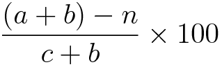

# MIS Bot

# Introduction
I created this bot as a means to avoid Defaulter's List, and I hope this bot can help others avoid it, too. The bot is hosted on Digital Ocean. 

## Features
  * **CAPTCHA Bypass**
  
    The bot can automatically answer the captcha code for logging in. Uses [securimage_solver](https://github.com/sampritipanda/securimage_solver) library.
  * **Bunk Calculator**
  
    Calculate rise/drop in your overall percentage.

    

    where 

          a = Total lectures attended

          b = Total lectures conducted on the day of bunk

          c = Total lectures conducted so far

          n = number of lectures to bunk
  * **Until80**

    Shows the number of lectures one must consecutively attend in order to get their Overall Attendance to 80%. It is the minimum percentage of overall lectures one must attend to avoid the defaulter's list.

    

    where 

          a = Total lectures attended

          c = Total lectures conducted so far

          x = number of lectures to attend
    **Note:** We calculate `x` from this equation. Value of `x` can be negative too, when your attendance is already over 80.
  * **Until X**
  
    Like Until80 but you specify the percentage.
  
  * **Target Attendance**

    Set a target of attendance percentage for yourself and we'll remind you how long you've left to go before fulfilling your target.

  * **Results**

    Fetch results of Class Tests. Uses scrapy-splash library.

  

## Installation
[Read the wiki](https://github.com/ArionMiles/MIS-Bot/wiki) on getting this bot up and running for yourself.

# Roadmap
 * ~Attendance scraper~
 * ~Bunk/Until80 functions~
 * ~Allow registration~
 * ~Results scraper~
 * ~Store attendance data in a database~

# Contributors
 * [Arush Ahuja (arush15june)](https://github.com/arush15june)
 * [Vikas Yadav (v1k45)](https://github.com/v1k45)
 * [Sampriti Panda](https://github.com/sampritipanda)
 * [Sabine Wieluch (bleeptrack)](https://github.com/bleeptrack) (Gave us a really cute [Profile Photo](media/avatar.png)!)

# License
MIT License. Please see [License](LICENSE.md) file for more information.
